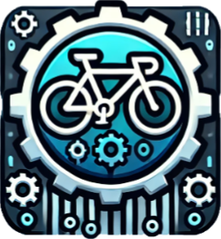
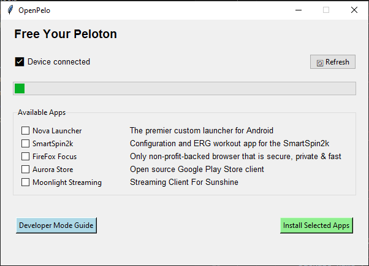

# OpenPelo


OpenPelo is a cross-platform tool for installing additional apps on your Peloton device. This installer automatically handles ADB setup and provides an easy-to-use interface for installing apps, combined with a step-by-step guide to enter developer mode. Combine this with [SmartSpin2k](https://Github.com/doudar/SmartSpin2k/) which adds automatic resistance, and virtual shifting for the ultimate Zwift setup. 
  

## Requirements

- Python 3.6 or higher
- USB cable to connect your Peloton (for initial setup), or WiFi network (for wireless connection)
- USB debugging enabled on your Peloton

## Installation
Watch on YouTube:

[](https://www.youtube.com/watch?v=X3oN8JhHe_8)

### Option 1: Pre-built Executables (Recommended)
1. Go to the [Releases](../../releases) page
2. Download the appropriate file for your system:
   - Windows: `OpenPelo.exe`
   - Mac: `OpenPelo`
3. Run the downloaded file

### Option 2: Run from Source
1. Install Python 3.6 or higher:
   - Windows: Download from [python.org](https://www.python.org/downloads/)
   - Mac: Use Homebrew: `brew install python3`
2. Download this repository
3. Run `python openpelo.py` (Windows) or `python3 openpelo.py` (Mac). Depending on your python installation, it could also be 'py openpelo.py'.

## Usage

### Option 1: USB Connection (Recommended for First Setup)
1. Connect your Peloton to your computer via USB
2. Enable USB debugging on your Peloton:
   - Make sure your bike sensor cable is connected to the Peloton Tablet.
   - Go to Settings, system menu and perform a Firmware Reset.
   - Finish the initial setup and select "Skip Home Installation"
   - Go to Settings
   - Tap on Device Preferences
   - Tap 7 times on Build Number to enable Developer Options
   - Go back to Settings
   - Tap on Developer Options
   - Enable USB debugging
   - Disable Verify apps over USB
   - Enable Gabeldorsche
   - Go into your system, Apps, select system in the top right corner.
   - Force quit the App with the Peloton logo named "Device Management"
   - Plug your computer into the Peloton using a micro USB-B cable.  
   - Select "always allow this computer" and allow USB debugging. 
3. Run OpenPelo:
   - Double-click the downloaded executable
   - The installer will automatically check for your device
   - Wait for the "✅ Device connected" status
   - Select the apps you want to install by checking the boxes
   - Click "Install Selected Apps" and wait for the installation to complete

### Option 2: Wireless ADB Connection
Once you have enabled Developer Options (see Option 1), you can connect wirelessly:

1. **Enable Wireless Debugging on your Peloton:**
   - Make sure your Peloton and computer are on the same WiFi network
   - Go to Settings → Developer Options
   - Enable "Wireless debugging"
   - Tap on "Wireless debugging" text to open settings

2. **Connect via OpenPelo:**
   - Run OpenPelo
   - Click the "📶 Connect via WiFi" button
   - Follow the step-by-step guide
   - When prompted, tap "Pair device with pairing code" on your Peloton
   - Enter the displayed IP address, port, and pairing code into OpenPelo
   - Click "Connect"
   - Wait for "Successfully connected!" message

3. **Use OpenPelo wirelessly:**
   - Once connected, you can use all features wirelessly
   - Select apps and install them as you would with USB
   - Take screenshots and record screen wirelessly

## Features

- Modern graphical user interface
- USB and Wireless ADB connection support
- Real-time device connection status
- Visual progress indicators
- Easy app selection with checkboxes
- Automatic ADB installation and setup
- Cross-platform compatibility (Windows, Mac, Linux)
- Automatic app downloading and installation
- Configuration-based app management
- Screen recording and screenshot utilities

## For Developers

### Adding New Apps

To add new apps to the installer, simply edit the `apps_config.json` file. The configuration format is:

### Automated Builds

This project uses GitHub Actions to automatically build executables for Windows and Mac:
- Builds are triggered on pushes to main branch and pull requests
- Release builds are created automatically when a new release is published
- Built executables are available on the Releases page

The build process:
1. Sets up Python environment
2. Installs dependencies
3. Creates standalone executables using PyInstaller
4. Uploads executables as release assets

To create a new release:
1. Go to the Releases page
2. Click "Create a new release"
3. Tag version and publish
4. GitHub Actions will automatically build and attach the executables

```json
{
    "apps": {
        "App Name": {
            "url": "https://download.url/app.apk",
            "package_name": "com.example.app",
            "description": "Brief description of the app"
        }
    }
}
```

### Fields:
- `App Name`: Display name in the installer menu
- `url`: Direct download URL for the APK file
- `package_name`: Android package name (used for installation)
- `description`: Brief description of the app

## Troubleshooting

1. "❌ No device detected"
   - Ensure USB cable is properly connected
   - Check that USB debugging is enabled
   - Try a different USB cable or port
   - Click the "🔄 Refresh" button after fixing the connection

2. "Failed to setup ADB"
   - Check your internet connection
   - Try running the installer with administrator/sudo privileges
   - If using antivirus, temporarily disable it during ADB installation
   - Restart the installer and try again

3. Installation Errors
   - If an app fails to install, check your device's storage space
   - Ensure your internet connection is stable
   - Try installing apps one at a time
   - Check the error message shown in the popup for specific issues

4. Wireless Connection Issues
   - "Pairing Failed"
     - Verify your Peloton and computer are on the same WiFi network
     - Double-check the IP address, port, and pairing code
     - Make sure wireless debugging is still enabled on your Peloton
     - Try generating a new pairing code on your Peloton
   - "Connection Timeout"
     - Check your WiFi connection strength
     - Ensure no firewall is blocking the connection
     - Try moving your computer closer to the WiFi router
   - "Connection Failed after pairing"
     - The device may have disconnected. Try clicking "🔄 Refresh"
     - Try connecting again using the "📶 Connect via WiFi" button
     - Restart wireless debugging on your Peloton and try again

## Security Note

This installer only downloads apps from trusted sources specified in the configuration file. However, users should always be cautious when installing third-party applications on their devices.

## License

This project is licensed under the MIT License - see the LICENSE file for details.
