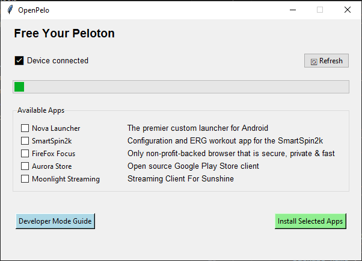

# OpenPelo


OpenPelo is a Flutter desktop app for installing Android applications and
managing ADB-enabled devices. It is designed primarily for Android-based
fitness equipment such as Peloton, Echelon, and NordicTrack, but it can work
with other Android tablets, phones, and TVs.



## Features

- Bundled Android Platform-Tools; users do not need a separate ADB install
- USB and wireless ADB connections
- Curated application catalog with ARM64 and ARMv7 variants
- Local APK installation
- Screen mirroring, screenshots, and screen recording
- Device file manager for browsing, uploading, and downloading files
- Installed-app, launcher, rotation, and developer-setting management
- Windows, macOS, and Linux desktop builds

## Install a release

Download the appropriate artifact from the
[GitHub Releases](../../releases) page:

- Windows: `OpenPelo_Setup_Windows.exe`
- macOS: `OpenPelo-macOS.dmg`
- Linux: `OpenPelo-Linux.tar.gz`

On first launch, OpenPelo extracts its bundled copy of ADB into the operating
system's application-support directory.

## Connect a device

### USB

1. Enable Developer Options on the Android device.
2. Enable USB debugging.
3. Connect the device with a USB data cable.
4. Accept the device's **Allow USB debugging** prompt.
5. Launch OpenPelo and select the detected device.

### Wireless ADB

Open **Connect via WiFi** and follow the on-screen guide. Android 11 and newer
normally require a pairing port and six-digit pairing code before connecting.
The desktop builds support `adb pair`; the experimental mobile ADB client does
not currently support pairing a new device.

### Automatic WiFi connection

Desktop builds always maintain wireless ADB connections automatically. After
you connect an Android device wirelessly once, OpenPelo verifies its manufacturer
and hardware serial, enables legacy ADB on port 5555, and remembers its address.
Setup may briefly interrupt the original connection. This works with any
manufacturer whose firmware supports legacy TCP/IP ADB and reports a usable
hardware serial. Devices connected only by USB are not switched automatically.

While OpenPelo is running, it retries remembered devices when disconnected,
including after reopening the app. This can reconnect even when the tablet's
**Wireless debugging** toggle is off. Retry delays increase from 10 seconds to
five minutes when a device is unavailable. When both wireless connections are
present, OpenPelo shows the port-5555 connection. Peloton devices appear at the
top of the device list; all other devices remain available, and your selected
target is preserved. It verifies the manufacturer and hardware serial
before using a remembered address, so a reassigned IP cannot silently select a
different device.

Legacy ADB is **unencrypted**: use this feature only on a trusted local network.
Rebooting the tablet may
remove the listener. If that happens, or its IP changes while disconnected,
connect normally again so OpenPelo can set it up and remember the new address.

Tested on a Peloton PLTN-RB1VO-2 running Android 11: port 5555 accepted a fresh
connection with Wireless debugging off. Survival of the reported approximately
24-hour automatic shutdown has not yet been verified.

## Build from source

### Requirements

- Flutter 3.44.4 or newer
- Dart 3.10 or newer
- Platform prerequisites from Flutter's desktop setup guide
- Inno Setup 6 when creating the Windows installer

```powershell
flutter pub get
flutter analyze
flutter test
flutter run -d windows
```

Use `-d macos` or `-d linux` on those platforms. Release bundles are created
with:

```powershell
flutter build windows --release
flutter build macos --release
flutter build linux --release
```

See [DISTRIBUTION.md](./DISTRIBUTION.md) for packaging details.

## Application catalog

Applications are defined in `apps_config.json`:

```json
{
  "apps": {
    "Example App": {
      "url": "https://github.com/example/app/releases/latest",
      "asset_name": "example-arm64.apk",
      "asset_pattern": "example-*-arm64.apk",
      "package_id": "com.example.app",
      "sha256": "optional-lowercase-sha256",
      "description": "Description shown in OpenPelo",
      "abi": "arm64-v8a"
    }
  }
}
```

- `url` must use HTTPS. GitHub latest-release URLs and API URLs are resolved
  to release assets automatically.
- `asset_name` is the preferred APK filename.
- `asset_pattern` is an optional glob used when release filenames contain a
  changing version. Ambiguous matches are rejected.
- `package_id` is the optional Android application ID used when resolving an
  incompatible-signature reinstall.
- `sha256` is an optional integrity checksum. Add it whenever the URL points
  to an immutable, versioned APK.
- `abi` is `arm64-v8a` or `armeabi-v7a`.

## Automated builds

GitHub Actions formats, analyzes, and tests the project before building
Windows, macOS, and Linux artifacts. Pull requests receive unsigned validation
builds. Trusted pushes to `main` additionally sign and notarize the macOS DMG,
bump the patch version, tag it, and publish a GitHub release.

The Windows installer version is injected from `version.json` by the workflow.
Mobile releases require their own signing configuration; Android release
credentials belong in an untracked `android/key.properties` file.

## Security

OpenPelo can install third-party software and modify system settings on a
connected Android device. Review catalog changes carefully. Downloads are
restricted to HTTPS and checked for APK/ZIP structure; immutable downloads can
also be pinned with SHA-256. Android still performs its normal package-signing
checks during installation.

Some device-management operations are destructive. Back up important data and
read confirmation dialogs before proceeding.

## Disclaimer

OpenPelo is independent and is not affiliated with, authorized by, endorsed
by, or otherwise connected to Peloton Interactive, Inc. Product and company
names are trademarks of their respective owners. Use this software at your own
risk.

## License

OpenPelo is available under the [MIT License](./LICENSE).
