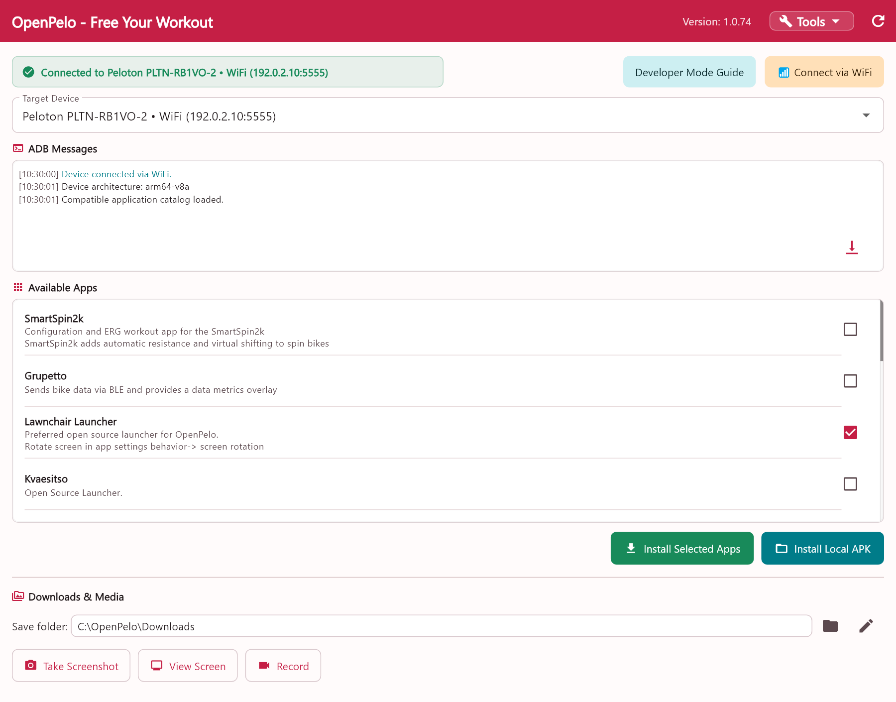
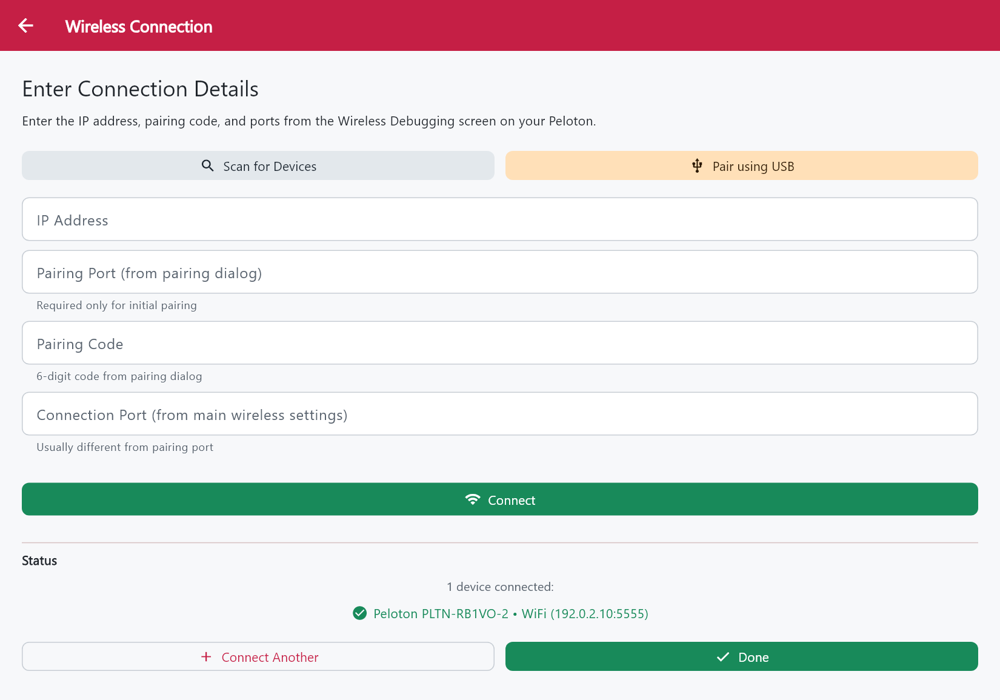
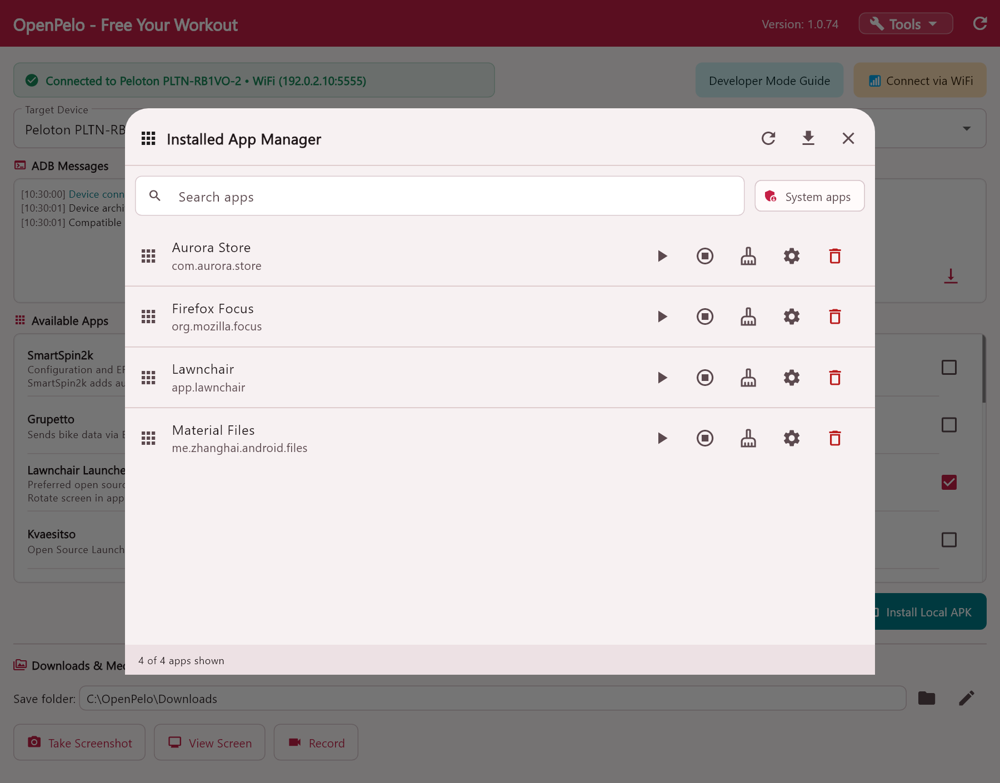
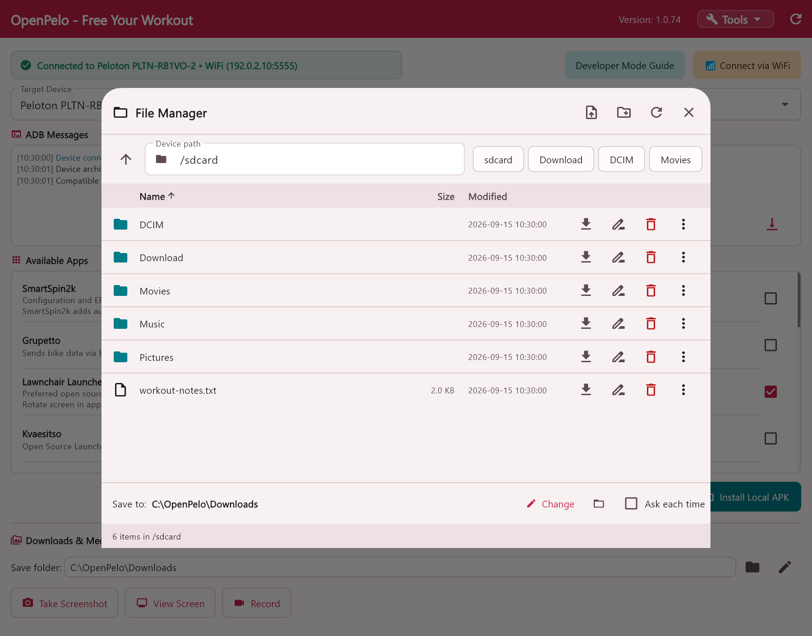
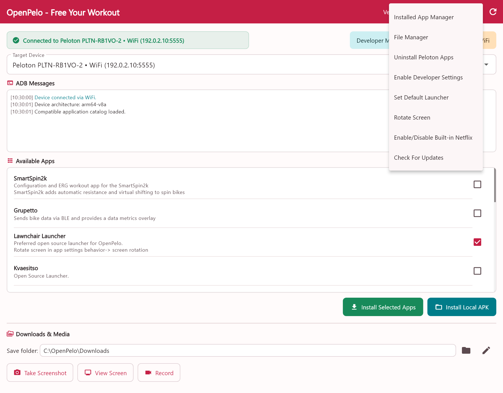

# OpenPelo


OpenPelo is a Flutter desktop app for installing Android applications and
managing ADB-enabled devices. It is designed primarily for Android-based
fitness equipment such as Peloton, Echelon, and NordicTrack, but it can work
with other Android tablets, phones, and TVs.



*Screenshots render the current Flutter interface with sample device, app, and
file data. No personal device identifiers or files are shown.*

[Install](#install-a-release) · [Connect a device](#connect-a-device) ·
[Feature walkthrough](#feature-walkthrough) · [Troubleshooting](#troubleshooting) .
[Build from source](#build-from-source)

## Features

| Feature | What you can do |
| --- | --- |
| Device connections | Connect over USB or WiFi, discover wireless devices, and switch the target device. Desktop builds remember wireless connections and retry them automatically. |
| App installation | Select multiple catalog apps or install a local APK. The catalog selects ARM64 or ARMv7 entries for the device. |
| Installed App Manager | Search installed packages, launch or force-stop apps, open app settings, clear data, uninstall, and export the visible list. |
| File Manager | Browse device storage, sort entries, upload and download files or download folders, and create, rename, or delete folders and files. |
| Remote screen and media | Control the device through a screen preview, save PNG screenshots, and record MP4 videos. |
| Device tools | Choose a default launcher, rotate the screen, apply developer settings, and access Peloton-specific tools. |
| Desktop distribution | Windows, macOS, and Linux builds include Android Platform-Tools; a separate ADB installation is not required. |

## Install a release

Download the appropriate artifact from the
[GitHub Releases](../../releases) page:

- Windows: `OpenPelo_Setup_Windows.exe`
- macOS: `OpenPelo-macOS.dmg`
- Linux: `OpenPelo-Linux.tar.gz`

On first launch, OpenPelo extracts its bundled copy of ADB into the operating
system's application-support directory.

## Connect a device

### USB

1. Enable Developer Options on the Android device.
2. Enable USB debugging.
3. Connect the device with a USB data cable.
4. Accept the device's **Allow USB debugging** prompt.
5. Launch OpenPelo, click **Refresh Devices** if needed, and choose the device
   from **Target Device**. The status banner and **ADB Messages** show connection
   progress.

The **Developer Mode Guide** on the home screen provides an in-app setup
walkthrough. Menu locations depend on the device and its firmware.

### Wireless ADB



1. Connect the computer and Android device to the same local network.
2. Open **Connect via WiFi**, follow the guide, and click
   **I'm Ready - Connect Device**.
3. For a new Android 11+ wireless-debugging connection, open the device's
   **Pair device with pairing code** dialog. Enter its IP address, **Pairing
   Port**, and six-digit **Pairing Code** in OpenPelo.
4. Enter the **Connection Port** from the device's main Wireless debugging
   screen. This is usually different from the pairing port.
5. Click **Connect** and check the status below the form. Click **Done** to
   return to the home screen, or **Connect Another** to clear the form and add
   another device.

**Scan for Devices** discovers advertised wireless ADB services and lets you
fill the IP address and available ports from a discovered device. You still
enter the pairing code from the device. If discovery finds nothing, enter the
details manually. Pairing details are only needed for initial pairing; an
already paired device can connect using its IP address and connection port.

The desktop builds support `adb pair`; the experimental mobile ADB client does
not currently support pairing a new device.

### Set up WiFi through USB

If the device is already connected and authorized over USB, open the wireless
connection form and click **Pair using USB**. Choose the USB device if more
than one is connected. Keep the cable attached while OpenPelo enables TCP/IP
ADB and connects to the device's WiFi address on port 5555. Unplug the cable
only after the **Wireless ADB Enabled** message appears. The device must already
be connected to WiFi, and its firmware must support this mode.

### Automatic WiFi connection

Desktop builds always maintain wireless ADB connections automatically. After
you connect an Android device wirelessly once, OpenPelo verifies its manufacturer
and hardware serial, and remembers its address.

After you successfully connect a device over WiFi, desktop versions of OpenPelo remember its verified identity and network address. While OpenPelo is open—including after you close and reopen it—it automatically tries to restore the connection if it drops. On supported devices, this may work even when Wireless debugging is switched off, provided the device is still accepting ADB connections on port 5555.

Tested on a Peloton PLTN-RB1VO-2 running Android 11: port 5555 accepted a fresh
connection with Wireless debugging off.  This behavior is device and firmware dependent.

## Feature walkthrough

### 1. Choose the device and follow activity

Use **Target Device** to choose where installation and device tools operate.
The list identifies USB and WiFi connections. Peloton devices appear first;
other Android devices remain available. Check this selection before starting
an operation when multiple devices are connected.

The status banner summarizes the connection. **ADB Messages** shows timestamped
commands, output, and errors, making it the first place to look when an install,
transfer, or setting change fails. Scroll back to inspect earlier messages;
the down-arrow control returns to the latest output. **Refresh Devices** checks
the connection again and refreshes the compatible app list.

### 2. Install catalog apps or a local APK

1. Connect and select a device to populate **Available Apps**.
2. Read the descriptions and check the apps you want. Scroll inside the catalog
   to see more entries.
3. Click **Install Selected Apps**. OpenPelo downloads and installs the selected
   packages; follow **ADB Messages** for progress and results.
4. To install an APK you already have, click **Install Local APK** and choose
   the `.apk` file on your computer.

The bundled catalog includes fitness utilities such as SmartSpin2k and Grupetto,
launchers such as Lawnchair, app stores, browsers, file managers, and media or
streaming clients. Older ARMv7 devices receive a separate set of entries,
including legacy versions where configured. The exact list comes from
[`apps_config.json`](./apps_config.json). Architecture filtering does not
guarantee compatibility with every Android version or device firmware.

If Android reports a **Signature Mismatch**, OpenPelo offers **Uninstall &
Reinstall**. That removes the existing app and its local data before reinstalling.
Choose **Cancel** to keep the current installation.

### 3. Manage installed apps



Open **Tools → Installed App Manager** to inspect apps on the selected device.

- **Search apps** filters by app label or package name. Enable **System apps**
  to include system packages, and use **Refresh** to reload the list.
- **Launch** starts an app and opens the remote screen view. **Force stop**
  stops the app; **App settings** opens its Android settings and the remote
  screen view so you can interact with them.
- **Clear data** resets the app's local data after confirmation. **Uninstall**
  removes the selected user app after confirmation; this action is disabled
  for system apps.
- **Export visible list** writes the filtered list to a timestamped `.txt` file
  in the save folder, with app label, package name, and system/user type.

### 4. Manage device files



Open **Tools → File Manager** to browse and manage files on the selected device.

- Browse from `/sdcard`, jump to common media directories, or enter a device
  path directly.
- Upload files, download files or entire folders, and create, rename, or delete
  directories and files.
- Sort directory contents by name, size, or modification time.
- Use the configured save folder for downloads, choose a destination for an
  individual transfer, or enable **Ask each time**.
- Monitor transfer progress and open completed downloads in your computer's
  file manager.

Available directories depend on the device's ADB permissions; protected Android
storage may be inaccessible.

### 5. View, control, and capture the device screen

The home screen's **Downloads & Media** section groups the save folder and
capture controls. Scroll down if it is below the visible area of the window.

| Control | Walkthrough |
| --- | --- |
| **Save folder** | Use **Change Location** to choose the computer folder used for media, file downloads, and app-list exports. **Open Folder** opens it in your file browser. |
| **Take Screenshot** | Capture the selected device's display as `screenshot_YYYYMMDD_HHmmss.png` in the save folder. Check ADB Messages for the saved path or an error. |
| **View Screen** | Open **Remote Screen View**. Click the preview to tap the device; drag, use the mouse wheel, or press arrow keys to scroll. **Back**, **Home**, and **Recents** send Android navigation actions. |
| **Record / Stop Rec** | Click **Record** to start device screen recording. Click **Stop Rec** to stop and download `recording_YYYYMMDD_HHmmss.mp4` to the save folder. Keep the device connected while saving. |

Remote Screen View is a low-framerate preview intended for navigation and
troubleshooting. Recording support and limits depend on the Android device's
screen-recording implementation.

### 6. Configure the launcher and device tools



Open **Tools** in the upper-right corner for these additional controls:

- **Set Default Launcher:** install a launcher first, then open this tool to
  see detected launchers and the current default. Click **Set Default** beside
  a launcher. OpenPelo reads back the HOME setting and reports whether the
  change was verified.
- **Rotate Screen:** use **Rotate** to cycle the orientation in 90-degree steps,
  or enable **Auto-rotate** to use the device's accelerometer. Apps and firmware
  can impose their own orientation behavior.
- **Enable Developer Settings:** choose **Wireless Debugging** and/or **Stay
  Awake While Charging**, then click **Apply**. OpenPelo reports results for
  the requested settings. This tool needs an existing ADB connection; use the
  setup guide to establish the first connection.
- **Enable/Disable Built-in Netflix:** a Peloton-specific tool with **Enable
  Netflix** and **Restore Defaults** actions. It adjusts device settings and
  disables an OEM system component when enabling support. Read the dialog's
  caution: other OEM/system features can be affected. Restore defaults if
  they misbehave; availability depends on the device and firmware.
- **Uninstall Peloton Apps:** scans for Peloton packages and lets you select
  packages to remove. While this is in practice completely reversible with a reset to defaults, this is an advanced action. Review the app's warning and
  final confirmation carefully.
- **Check For Updates:** checks OpenPelo's GitHub releases. When a newer version
  is found, the home screen shows **View Release**, which opens the release
  page for download. A failed check offers **Retry**.

## Troubleshooting

| Symptom | What to check |
| --- | --- |
| No device or empty catalog | Enable USB debugging, use a data-capable cable, accept the device's authorization prompt, click **Refresh Devices**, and select **Target Device**. |
| Wireless pairing fails | Check the current six-digit code and pairing port in the device's pairing dialog. The connection port comes from the main Wireless debugging screen. |
| Scan finds nothing | Check that both devices are on the same network and wireless debugging is enabled. Try entering the address and ports manually. |
| A remembered WiFi device stops reconnecting | The device may have rebooted, changed IP address, or stopped listening on port 5555. Connect normally again to refresh the remembered connection. |
| An APK will not install | Read **ADB Messages** for Android's error. Check the APK's architecture, Android-version requirements, and signing compatibility with an existing installation. |
| A file or system setting cannot be accessed | Check the logged result. Device firmware and Android permissions can restrict ADB operations even when the connection succeeds. |
| Capture controls are missing from view | Scroll the home page to **Downloads & Media**, or enlarge the window. |

## Build from source

### Requirements

- Flutter 3.44.4 or newer
- Dart 3.10 or newer
- Platform prerequisites from Flutter's desktop setup guide
- Inno Setup 6 when creating the Windows installer

```powershell
flutter pub get
flutter analyze
flutter test
flutter run -d windows
```

Use `-d macos` or `-d linux` on those platforms. Release bundles are created
with:

```powershell
flutter build windows --release
flutter build macos --release
flutter build linux --release
```

See [DISTRIBUTION.md](./DISTRIBUTION.md) for packaging details.

### Refresh the README screenshots

The [screenshot script](./tool/capture_readme_screenshots_test.dart) renders the
production screens and dialogs with sample data. It does not initialize ADB or
connect to a device. From the repository root, run:

```powershell
flutter test tool/capture_readme_screenshots_test.dart
```

It writes five PNGs to [`images/screenshots`](./images/screenshots). The script
uses Windows Segoe UI by default; on another platform, set
`OPENPELO_SCREENSHOT_FONT` to the absolute path of a local TrueType font.
Review the generated images before committing them with UI changes.

## Application catalog

Applications are defined in `apps_config.json`:

```json
{
  "apps": {
    "Example App": {
      "url": "https://github.com/example/app/releases/latest",
      "asset_name": "example-arm64.apk",
      "asset_pattern": "example-*-arm64.apk",
      "package_id": "com.example.app",
      "sha256": "optional-lowercase-sha256",
      "description": "Description shown in OpenPelo",
      "abi": "arm64-v8a"
    }
  }
}
```

- `url` must use HTTPS. GitHub latest-release URLs and API URLs are resolved
  to release assets automatically.
- `asset_name` is the preferred APK filename.
- `asset_pattern` is an optional glob used when release filenames contain a
  changing version. Ambiguous matches are rejected.
- `package_id` is the optional Android application ID used when resolving an
  incompatible-signature reinstall.
- `sha256` is an optional integrity checksum. Add it whenever the URL points
  to an immutable, versioned APK.
- `abi` is `arm64-v8a` or `armeabi-v7a`.

## Automated builds

GitHub Actions formats, analyzes, and tests the project before building
Windows, macOS, and Linux artifacts. Pull requests receive unsigned validation
builds. Trusted pushes to `main` additionally sign and notarize the macOS DMG,
bump the patch version, tag it, and publish a GitHub release.

The Windows installer version is injected from `version.json` by the workflow.
Mobile releases require their own signing configuration; Android release
credentials belong in an untracked `android/key.properties` file.

## Security

OpenPelo can install third-party software and modify system settings on a
connected Android device. Review catalog changes carefully. Downloads are
restricted to HTTPS and checked for APK/ZIP structure; immutable downloads can
also be pinned with SHA-256. Android still performs its normal package-signing
checks during installation.

Some device-management operations are destructive. Back up important data and
read confirmation dialogs before proceeding.

## Disclaimer

OpenPelo is independent and is not affiliated with, authorized by, endorsed
by, or otherwise connected to Peloton Interactive, Inc. Product and company
names are trademarks of their respective owners. Use this software at your own
risk.

## License

OpenPelo is available under the [MIT License](./LICENSE).
